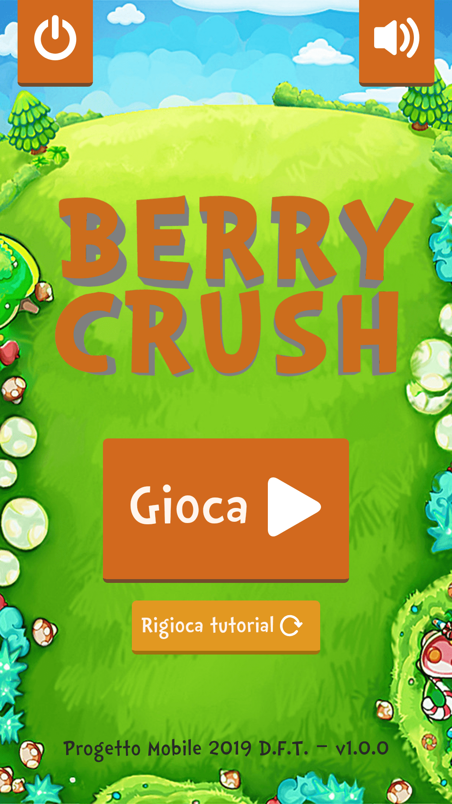
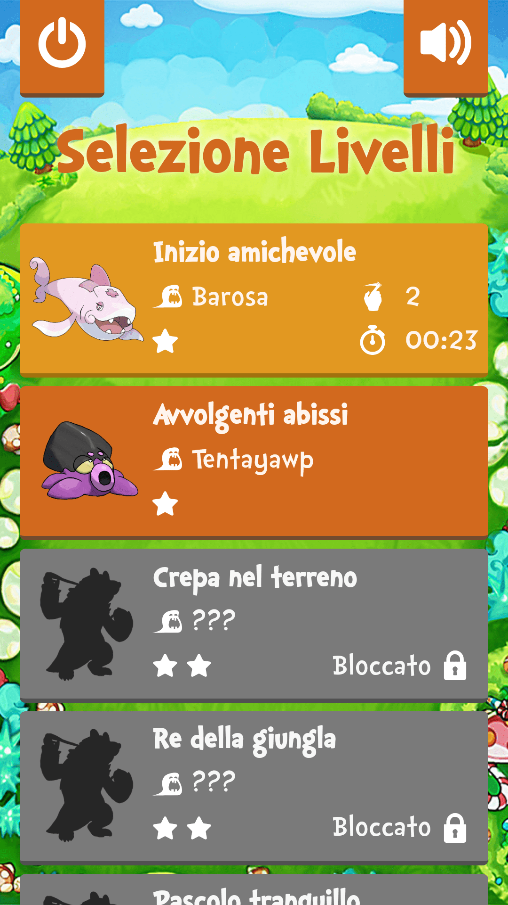
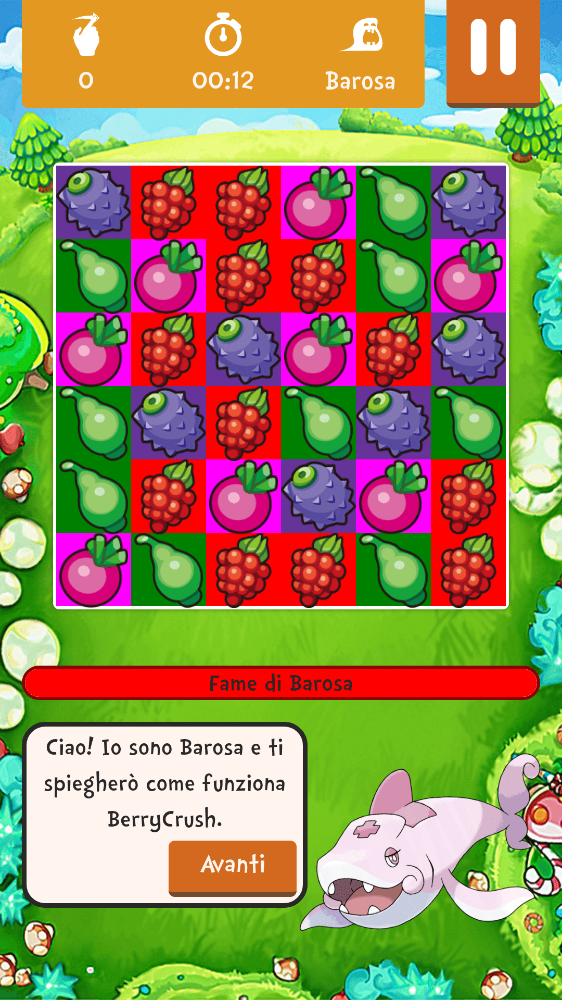
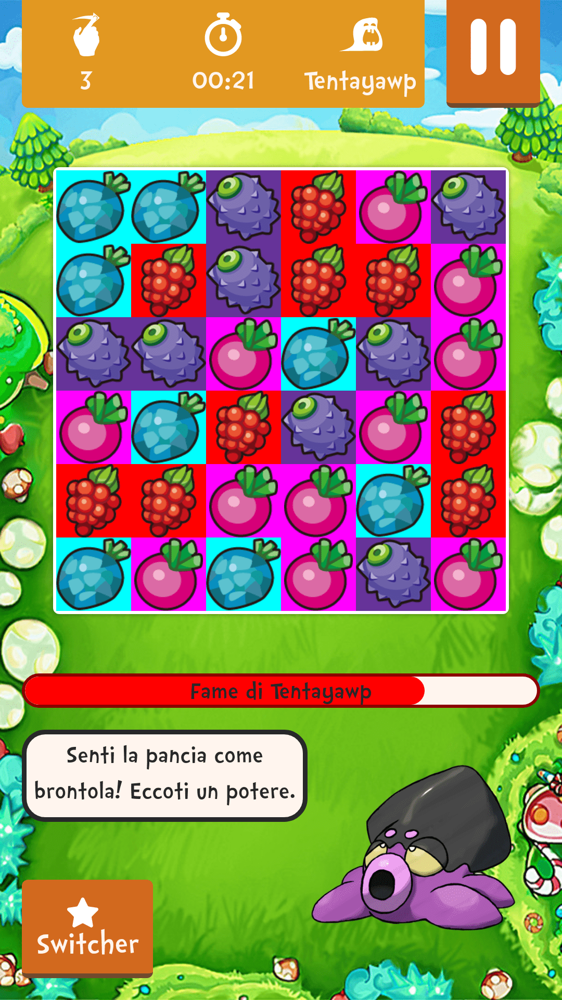
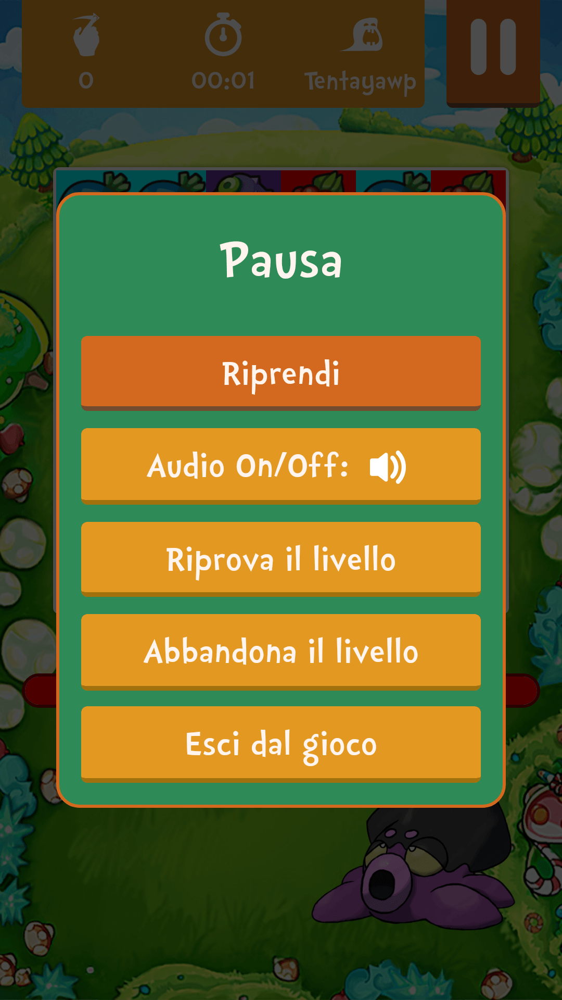
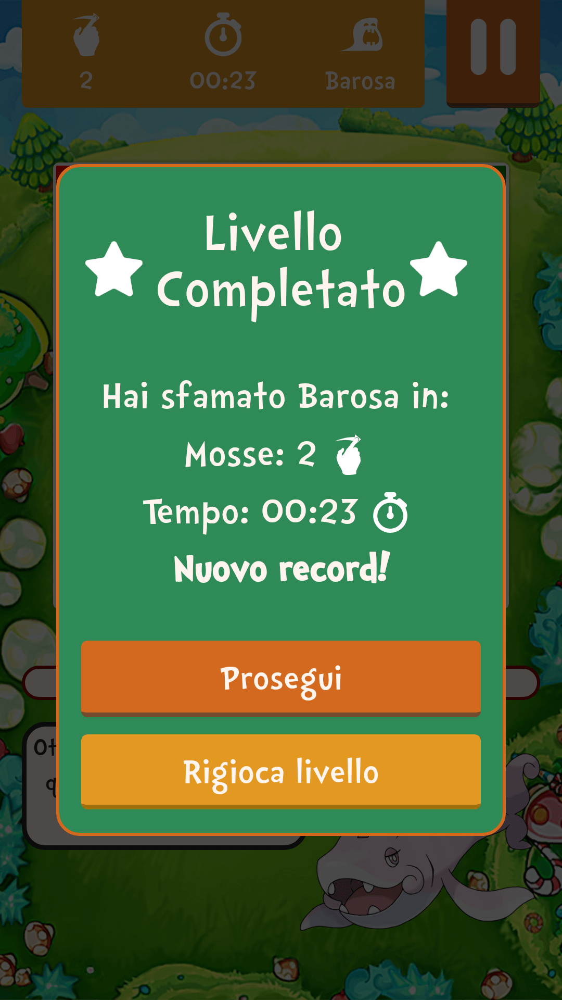

# Progetto Mobile Programming, "BerryCrush"

Progetto per il corso di Mobile Programming per la laurea triennale in Informatica presso [Università degli Studi di Padova](https://www.unipd.it/), primavera 2019.

Il progetto consiste nello sviluppare un gioco poco complesso (in questo caso un clone di CandyCrush) con due framework appartenenti ad approcci diversi della classificazione di Raj Tolety per confrontarne le prestazioni.

I framework scelti sono:

- **Ionic** per l'approccio ibrido;
- **NativeScript** per l'approccio Interpretato.

## Screen Applicazione

### Home

### Selezione Livelli

### Tutorial

### Livello normale

### Pausa

### Vittoria
